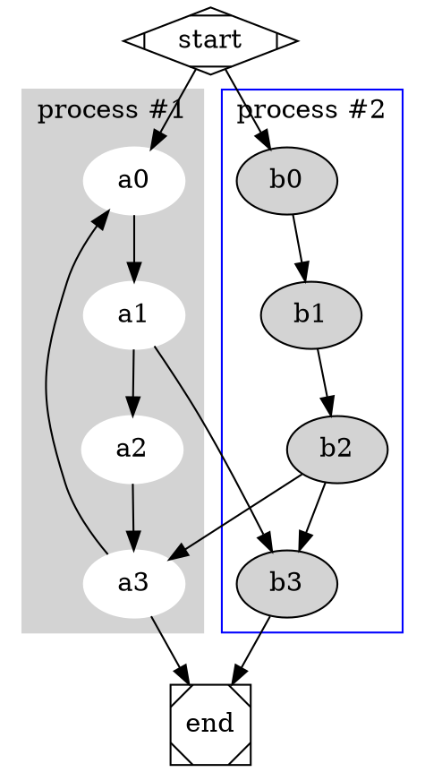
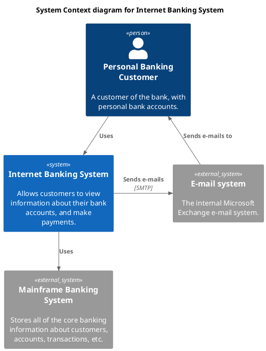
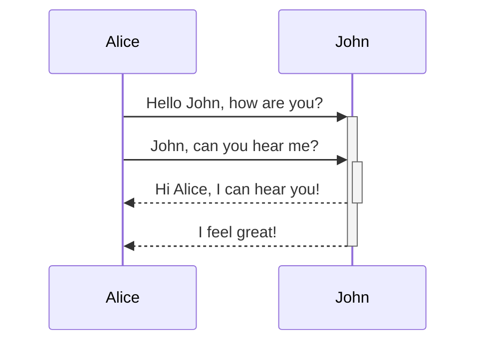
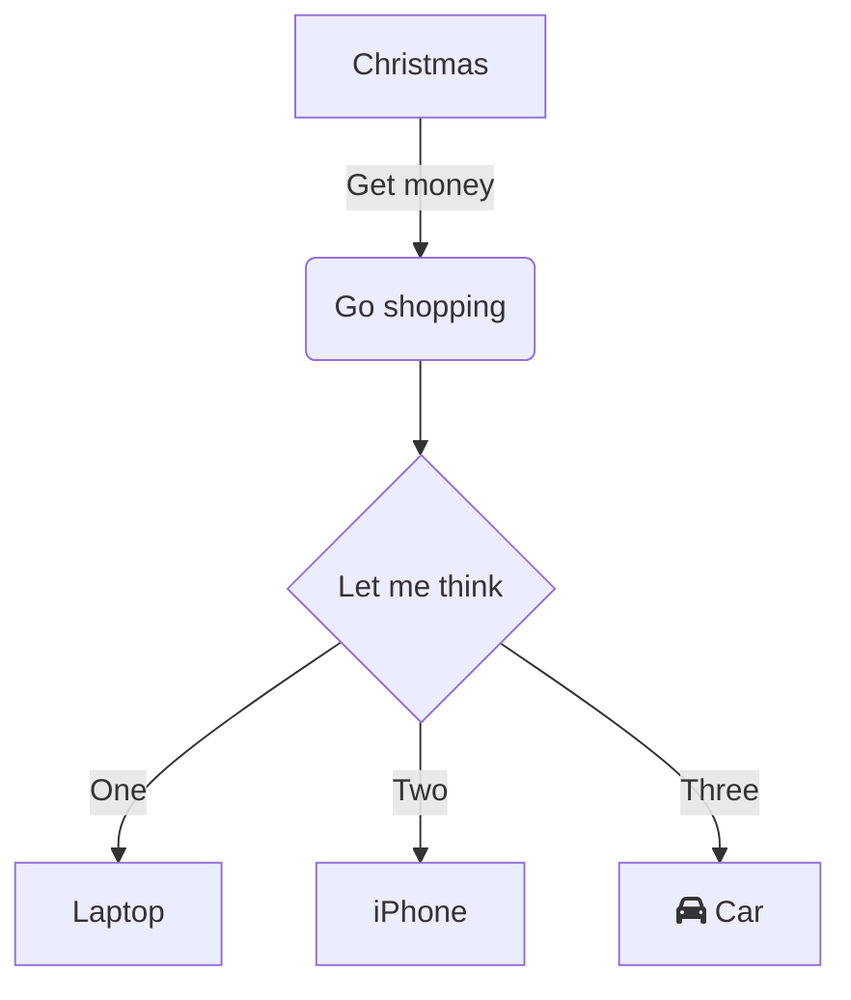

## Graph Visulziation

> Graph visualization is a way of representing structural information as diagrams of abstract graphs and networks. 
> Automatic graph drawing has many important applications in software engineering, database and web design, networking, 
> and in visual interfaces for many other domains.


### Graphviz

Graphviz is open source graph visualization software. Although it's written in C, many people already ported it by WASM and thus can be used in 
browser environemt.

https://github.com/hpcc-systems/hpcc-js-wasm

https://github.com/mdaines/viz-js

A remark plugin used here: https://github.com/chesiver/remark-hpcc-graphviz-svg

Eg. Dot code
```
digraph G {

	subgraph cluster_0 {
		style=filled;
		color=lightgrey;
		node [style=filled,color=white];
		a0 -> a1 -> a2 -> a3;
		label = "process #1";
	}

	subgraph cluster_1 {
		node [style=filled];
		b0 -> b1 -> b2 -> b3;
		label = "process #2";
		color=blue
	}
	start -> a0;
	start -> b0;
	a1 -> b3;
	b2 -> a3;
	a3 -> a0;
	a3 -> end;
	b3 -> end;

	start [shape=Mdiamond];
	end [shape=Msquare];
}

```

Rendered as



### PlantUML

Graphviz organizes the elements in a graph in the most efficient way possible. 
It can be configured to produce UML-like diagrams, but that's labor intensive.

PlantUML uses graphviz as a library to generate a variety of component diagrams. 
However PlantUML is written in Java, so no easy way to integrate it with client browser.

Thankfully, http://www.plantuml.com/plantuml/uml/ provides free PlantUML generation if we pass 
encoded PlantUML text as parameter, which is utilized by 
https://github.com/akebifiky/remark-simple-plantuml

C4 Model of PlantUML(https://github.com/plantuml-stdlib/C4-PlantUML) is very powerful for
visualising software architecture. Good for system design interview!


Eg.

```
@startuml
!include <C4/C4_Container>
title System Context diagram for Internet Banking System

Person(customer, "Personal Banking Customer", "A customer of the bank, with personal bank accounts.")
System(banking_system, "Internet Banking System", "Allows customers to view information about their bank accounts, and make payments.")

System_Ext(mail_system, "E-mail system", "The internal Microsoft Exchange e-mail system.")
System_Ext(mainframe, "Mainframe Banking System", "Stores all of the core banking information about customers, accounts, transactions, etc.")

Rel(customer, banking_system, "Uses")
Rel_Back(customer, mail_system, "Sends e-mails to")
Rel_Neighbor(banking_system, mail_system, "Sends e-mails", "SMTP")
Rel(banking_system, mainframe, "Uses")

@enduml
```

Rendered as 



### Mermaid

https://github.com/mermaid-js/mermaid

``` 
sequenceDiagram
    Alice->>+John: Hello John, how are you?
    Alice->>+John: John, can you hear me?
    John-->>-Alice: Hi Alice, I can hear you!
    John-->>-Alice: I feel great!
```



```
flowchart TD
    A[Christmas] -->|Get money| B(Go shopping)
    B --> C{Let me think}
    C -->|One| D[Laptop]
    C -->|Two| E[iPhone]
    C -->|Three| F[fa:fa-car Car]
```

