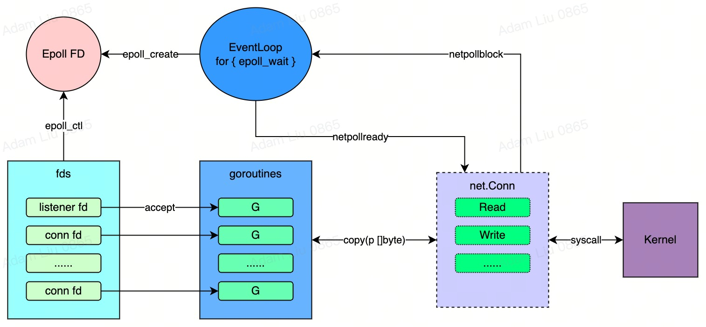
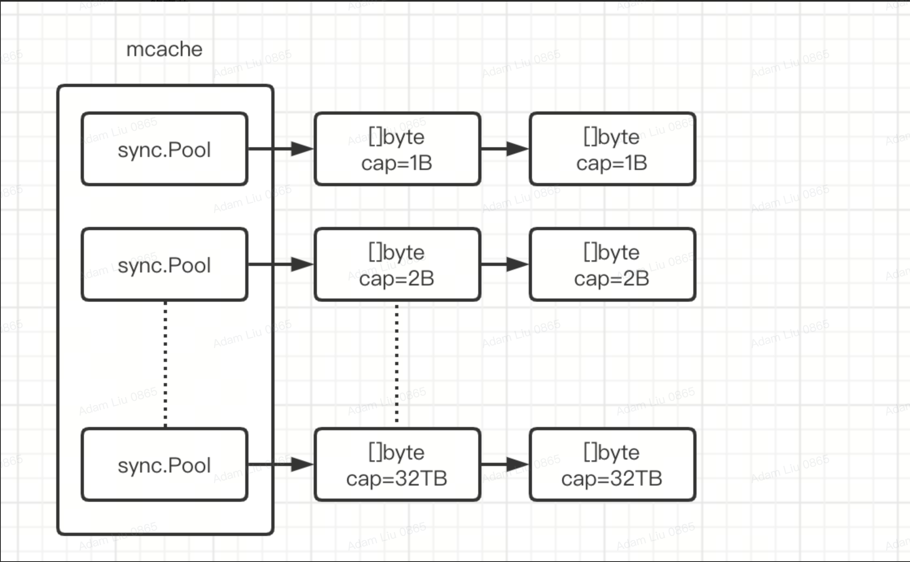
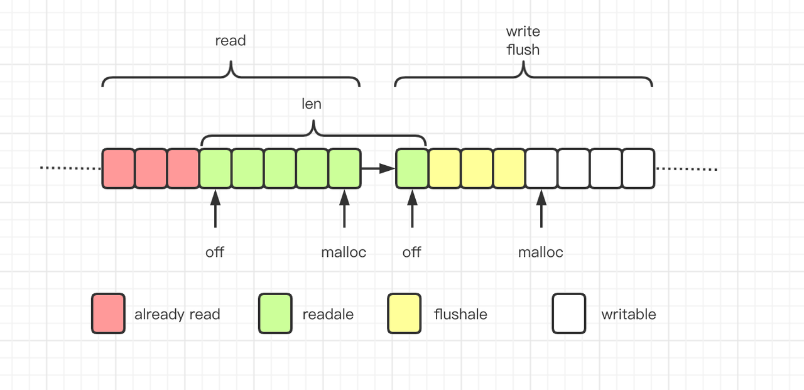

# Network I/O

Mostly focus on Golang I/O processing. 

When staying at Bytedance, a RPC framework is heavly used throught the entire company - [Kitex](https://github.com/cloudwego/kitex). Internally a network library
[Netpoll](https://github.com/cloudwego/netpoll) is used. 

I was a little bit supprised that it doesn't use golang's build-in net library, which means the commonly used pattern

*one goroutine per connection* 

is not enough for their use cases. 

## Prerequisite

### Epoll

```c
typedef union epoll_data {
    int      fd;
    //...
} epoll_data_t;

struct epoll_event {
    uint32_t     events;    /* Epoll events */
    epoll_data_t data;      /* User data variable */
};

int epoll_create(int size);
int epoll_ctl(int epfd, int op, int fd, struct epoll_event *event);
int epoll_wait(int epfd, struct epoll_event *events, int maxevents, int timeout);
```

epoll_create: open a epoll file descriptor

epoll_ctl: control interface for an epoll file descriptor

epoll_wait: wait for an I/O event on an epoll file descriptor

### Edge-triggerd vs Level-triggered

> In edge-triggered mode, a call to epoll_wait will return only when a new event is enqueued with the epoll object, 
while in level-triggered mode, epoll_wait will return as long as the condition holds.

### Golang Net Lib Architecture



- Each file descriptor maps to a goroutine. When event is not ready, register tfd into epollfd,
set goroutine to be Gwaiting state (park). When event is ready, corresponding goroutine is
set to be GRunnable
- User invikes read/write syscall in goroutine. Go net lib only helps event listening, and 
block/ready user's goroutine


### Netpoll Lib Architecture


#### Poll Manager
```go
type manager struct {
   NumLoops int
   balance  loadbalance // load balancing method
   polls    []Poll      // all the polls
}

func (m *manager) Run() error
func (m *manager) Pick() Poll
```
Poll manager maintains multiple poller, pick a random one by load balancing.

#### Poll API
```go
type Poll interface {
	// Wait will poll all registered fds, and schedule processing based on the triggered event.
	// The call will block, so the usage can be like:
	//
	//  go wait()
	//
	Wait() error

	// Close the poll and shutdown Wait().
	Close() error

	// Trigger can be used to actively refresh the loop where Wait is located when no event is triggered.
	// On linux systems, eventfd is used by default, and kevent by default on bsd systems.
	Trigger() error

	// Control the event of file descriptor and the operations is defined by PollEvent.
	Control(operator *FDOperator, event PollEvent) error

	// Alloc the operator from cache.
	Alloc() (operator *FDOperator)

	// Free the operator from cache.
	Free(operator *FDOperator)
}
```
Poll implements level-triggering, balancing implementations of different systems. Poll monitors a group of fds, by kevent/epoll, loop and block at Poll.Wait,
when kernel returns fd change list, according to change event types, notify FDOperator

```go
// PollEvent defines the operation of poll.Control.
type PollEvent int

const (
	// PollReadable is used to monitor whether the FDOperator registered by
	// listener and connection is readable or closed.
	PollReadable PollEvent = 0x1

	// PollWritable is used to monitor whether the FDOperator created by the dialer is writable or closed.
	// ET mode must be used (still need to poll hup after being writable)
	PollWritable PollEvent = 0x2

	// PollDetach is used to remove the FDOperator from poll.
	PollDetach PollEvent = 0x3

	// PollModReadable is used to re-register the readable monitor for the FDOperator created by the dialer.
	// It is only used when calling the dialer's conn init.
	PollModReadable PollEvent = 0x4

	// PollR2RW is used to monitor writable for FDOperator,
	// which is only called when the socket write buffer is full.
	PollR2RW PollEvent = 0x5

	// PollRW2R is used to remove the writable monitor of FDOperator, generally used with PollR2RW.
	PollRW2R PollEvent = 0x6
)
```

#### Event Loop
```go
type EventLoop interface {
	// Serve registers a listener and runs blockingly to provide services, including listening to ports,
	// accepting connections and processing trans data. When an exception occurs or Shutdown is invoked,
	// Serve will return an error which describes the specific reason.
	Serve(ln net.Listener) error

	// Shutdown is used to graceful exit.
	// It will close all idle connections on the server, but will not change the underlying pollers.
	//
	// Argument: ctx set the waiting deadline, after which an error will be returned,
	// but will not force the closing of connections in progress.
	Shutdown(ctx context.Context) error
}
```

#### Netpoll Server 
```go
type server struct {
	operator    FDOperator
	ln          Listener
	opts        *options
	onQuit      func(err error)
	connections sync.Map // key=fd, value=connection
}

func (s *server) Run() (err error)
func (s *server) Close(ctx context.Context) error
func (s *server) OnRead(p Poll) error
func (s *server) OnHup(p Poll) error
```

#### Connection
```go
// Connection supports reading and writing simultaneously,
// but does not support simultaneous reading or writing by multiple goroutines.
// It maintains its own input/output buffer, and provides nocopy API for reading and writing.
type Connection interface {
	// Connection extends net.Conn, just for interface compatibility.
	// It's not recommended to use net.Conn API except for io.Closer.
	net.Conn

	// The recommended API for nocopy reading and writing.
	// Reader will return nocopy buffer data, or error after timeout which set by SetReadTimeout.
	Reader() Reader
	// Writer will write data to the connection by NIO mode,
	// so it will return an error only when the connection isn't Active.
	Writer() Writer

	// IsActive checks whether the connection is active or not.
	IsActive() bool

	// SetReadTimeout sets the timeout for future Read calls wait.
	// A zero value for timeout means Reader will not timeout.
	SetReadTimeout(timeout time.Duration) error

	// SetWriteTimeout sets the timeout for future Write calls wait.
	// A zero value for timeout means Writer will not timeout.
	SetWriteTimeout(timeout time.Duration) error

	// SetIdleTimeout sets the idle timeout of connections.
	// Idle connections that exceed the set timeout are no longer guaranteed to be active,
	// but can be checked by calling IsActive.
	SetIdleTimeout(timeout time.Duration) error

	// SetOnRequest can set or replace the OnRequest method for a connection, but can't be set to nil.
	// Although SetOnRequest avoids data race, it should still be used before transmitting data.
	// Replacing OnRequest while processing data may cause unexpected behavior and results.
	// Generally, the server side should uniformly set the OnRequest method for each connection via NewEventLoop,
	// which is set when the connection is initialized.
	// On the client side, if necessary, make sure that OnRequest is set before sending data.
	SetOnRequest(on OnRequest) error

	// AddCloseCallback can add hangup callback for a connection, which will be called when connection closing.
	// This is very useful for cleaning up idle connections. For instance, you can use callbacks to clean up
	// the local resources, which bound to the idle connection, when hangup by the peer. No need another goroutine
	// to polling check connection status.
	AddCloseCallback(callback CloseCallback) error
}

type Reader interface {
   Next(n int) (p []byte, err error)
   Peek(n int) (buf []byte, err error)
   Skip(n int) (err error)
   ReadString(n int) (s string, err error)
   ReadBinary(n int) (p []byte, err error)
   ReadByte() (b byte, err error)
   Slice(n int) (r Reader, err error)
   Release() (err error)
   Len() (length int)
}

type Writer interface {
   Malloc(n int) (buf []byte, err error)
   WriteString(s string) (n int, err error)
   WriteBinary(b []byte) (n int, err error)
   WriteByte(b byte) (err error)
   WriteDirect(p []byte, remainCap int) error
   MallocAck(n int) (err error)
   Append(w Writer) (n int, err error)
   Flush() (err error)
   MallocLen() (length int)
}
```

Compare to net.Conn, Connection exposes underlying reader and writer ability, change to asyncronous I/O processing, 
and provides other connection managing methods

#### Link Buffer

##### Mcache


##### Structure
```go
type LinkBuffer struct {
	length     int64
	mallocSize int

	head  *linkBufferNode // release head
	read  *linkBufferNode // read head
	flush *linkBufferNode // malloc head
	write *linkBufferNode // malloc tail

	caches [][]byte // buf allocated by Next when cross-package, which should be freed when release
}

type linkBufferNode struct {
	buf      []byte          // buffer
	off      int             // read-offset
	malloc   int             // write-offset
	refer    int32           // reference count
	readonly bool            // read-only node, introduced by Refer, WriteString, WriteBinary, etc., default false
	origin   *linkBufferNode // the root node of the extends
	next     *linkBufferNode // the next node of the linked buffer
}
```

- Head => Read: Releasable
- Read => Flush: Readable 
- Flush => Write: Writable




Abstractly, LinkBuffer is also a 2-dimension slice. Syscall readv/writev is used
```go
func readv(fd int, bs [][]byte, ivs []syscall.Iovec) (n int, err error) {
   //...
   r, _, e := syscall.RawSyscall(syscall.SYS_READV, uintptr(fd), uintptr(unsafe.Pointer(&ivs[0])), uintptr(iovLen))
   //...
}

func writev(fd int, bs [][]byte, ivs []syscall.Iovec) (n int, err error) {
   //...
   r, _, e := syscall.RawSyscall(syscall.SYS_WRITEV, uintptr(fd), uintptr(unsafe.Pointer(&ivs[0])), uintptr(iovLen))
   //...
}

type Iovec struct {
   Base *byte
   Len  uint64
}

func iovecs(bs [][]byte, ivs []syscall.Iovec) (iovLen int)

```

### Difference between Netpoll && Net

1. Go Net uses Epoll ET. Netpoll uses LT
2. Netpoll uses more memory when there are many large packets
3. Go Net has only one event loop. Netpoll has many.
4. Go Net one conn maps to one goroutine. Netpoll uses a pool of goroutines
5. Netpoll supports zero copy.